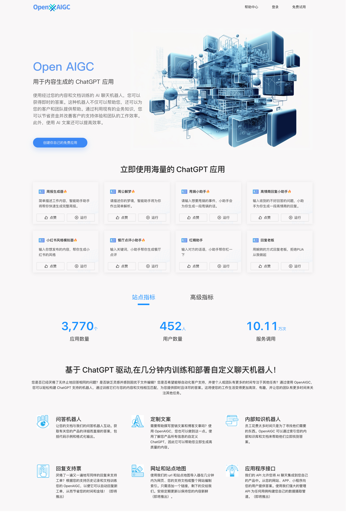

# OpenAIGC

网址：https://opaigc.com

OpenAIGC provides a language generation model based on GPT-4. Users can generate various types of content using their own API keys and hosts. The repository also offers sample code and tutorials to empower users to master generative AI technology and promote creativity and innovation. OpenAIGC 提供了基于 GPT-3 的语言生成模型网站，用户可以使用自己的 API 密钥和主机来生成各种类型的内容。该仓库还提供了示例代码和教程，帮助用户更好地掌握 Generative AI 技术，促进创意和创新的发展。

会在 [Twitter](https://twitter.com/fullbearded87) 上实时推送进展，欢迎点赞关注!

## 计划的功能

- [x] OpenAIGC 官网上线
- [ ] 用户可以直接运行每一个 App
  - [ ] 上线首页 6 组常用 App，包括 “周报生成器”、“周公解梦”等，使匿名用户也能通过工具找到兴趣点
- [ ] 用户可以注册并免费试用，每个用户可以创建任意数量公共的 APP
- [ ] APP 大市场，展示公共空间的所有 APP，并实现搜索功能
- [ ] 可以点赞，并可以据此排序
- [ ] 可以收藏，创建属于自己的 App 应用列表
- [ ] 开放问答机器人，提供给用户使用
- [ ] 可以创建只属于自己的私有 App
- [ ] 集成最新的 ChatGPT Promots 提供给所有用户使用
- [ ] 网址和站点地图，自动发送文章，保持站点的文章新鲜
- [ ] 开放 API 支持
- [ ] i18n 国际化支持

## 
